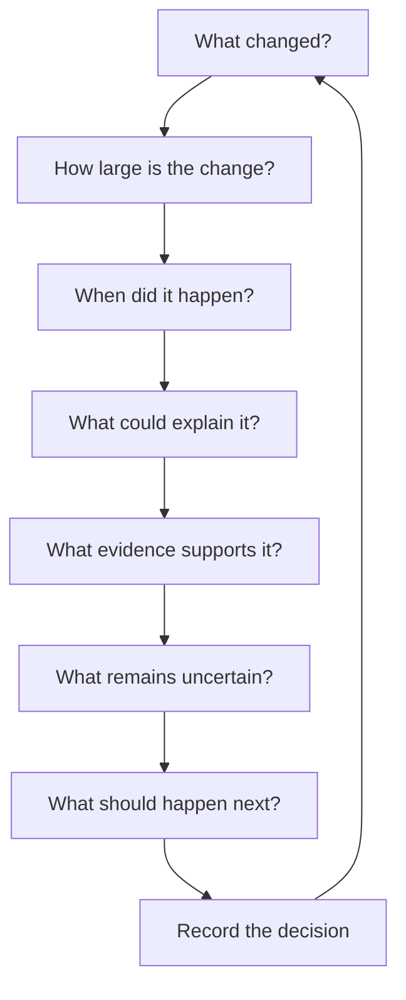
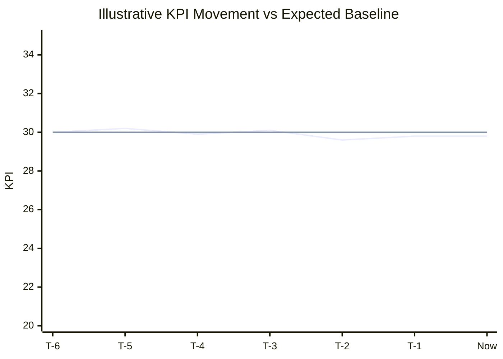
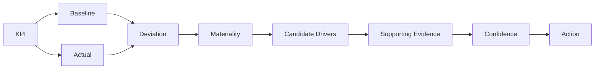
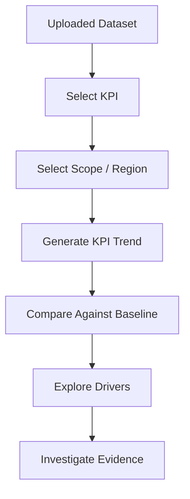
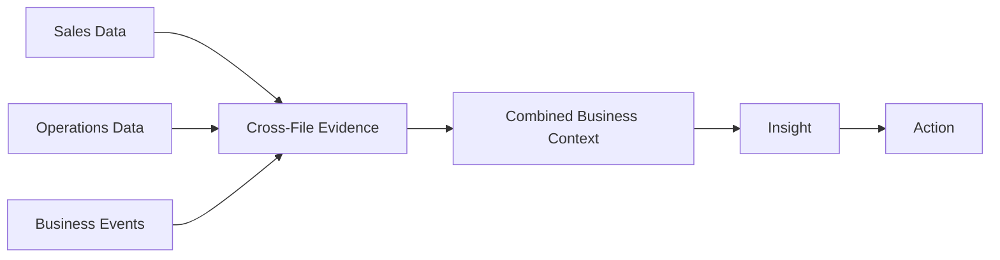
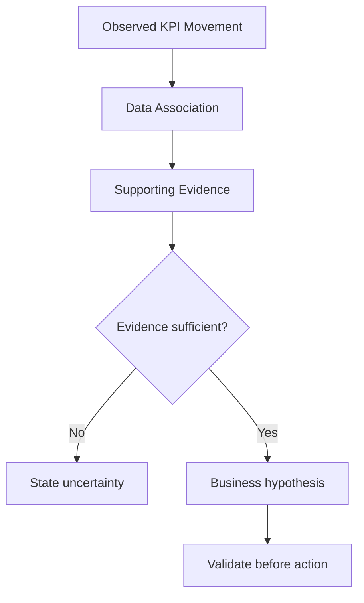
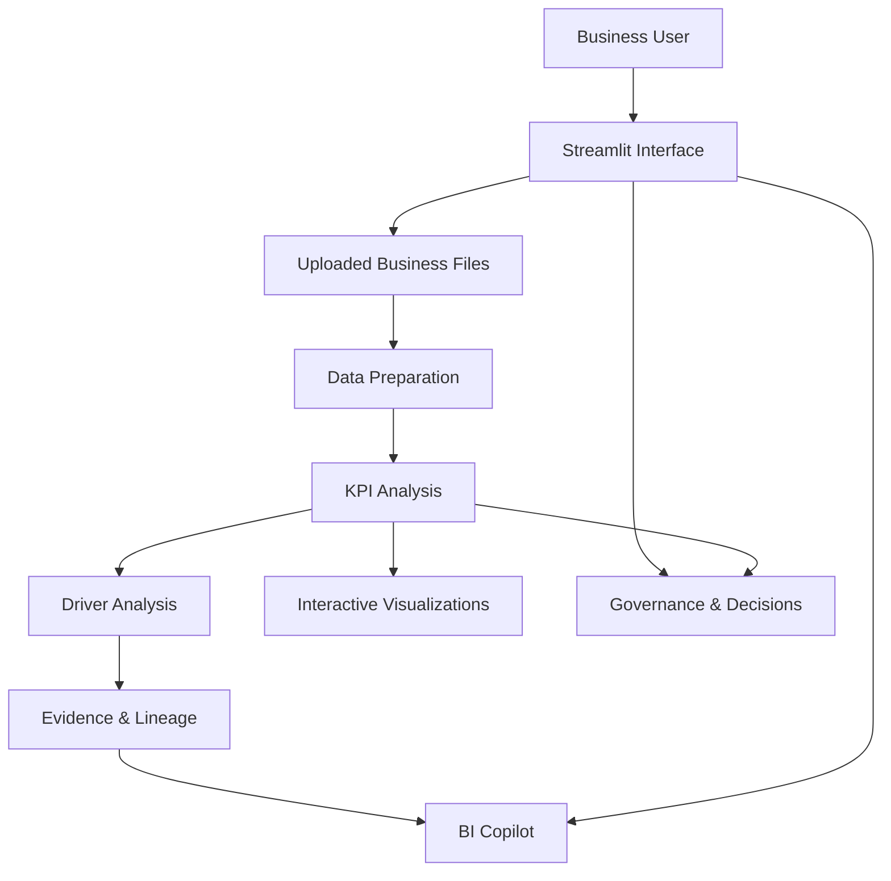
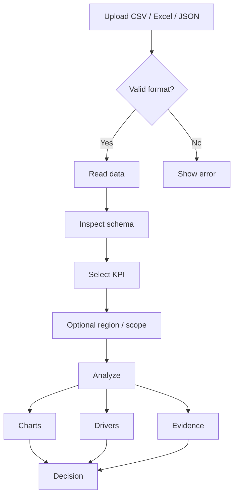
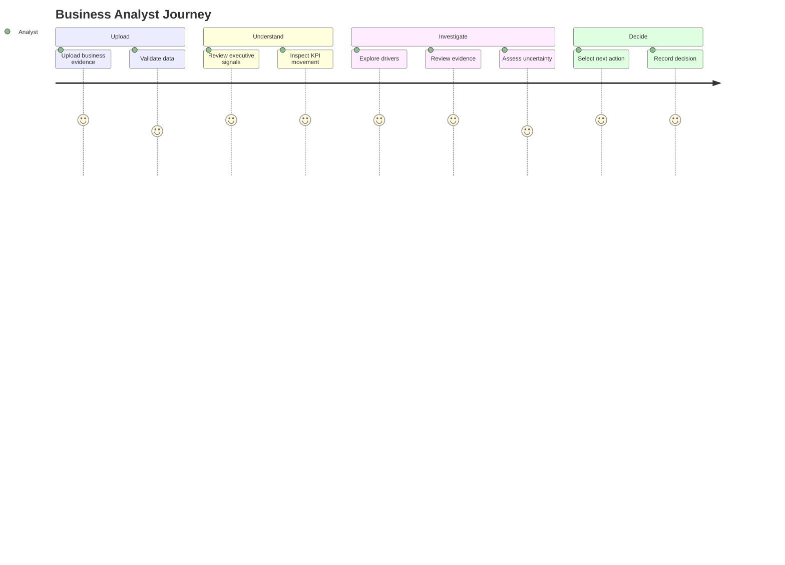

# 📊 BusinessIntelligence.ai

> **KPI intelligence → evidence → action**

BusinessIntelligence.ai is a decision-support prototype for turning business data into an executive-friendly investigation workflow: **what changed, why it may have changed, what evidence supports the explanation, how confident we are, and what to do next.**

---

## ✨ Core Features

- 📁 Upload business data
- 📊 Executive KPI overview
- 📈 KPI movement vs expected baseline
- 🔎 Driver investigation
- 🔗 Evidence & lineage
- ⚠️ Confidence / uncertainty
- 🎯 Action recommendations
- 💬 BI Copilot
- 🧩 Data & semantic definitions
- 🛡 Governance & telemetry
- 📝 Decision and feedback capture
- 📉 Interactive Plotly visualizations

---

## 🧭 End-to-End Workflow


### Decision Intelligence Loop



---

# 📈 Executive Dashboard

The main dashboard is designed around a clean executive signal layout:

```text
┌────────────────┐ ┌────────────────┐ ┌────────────────┐ ┌────────────────┐ ┌────────────────┐
│ GROSS MARGIN   │ │ REVENUE        │ │ VOLUME         │ │ INVENTORY      │ │ DISCOUNT RATE  │
│                │ │                │ │                │ │                │ │                │
│    29.8%       │ │     0.9K       │ │      101       │ │     4,862      │ │      9.0%      │
│ -0.2 pp        │ │ -4.7%          │ │ -3.4%          │ │ +8.3%          │ │ +15.3%         │
│ vs baseline    │ │ vs baseline    │ │ vs baseline    │ │ vs baseline    │ │ vs baseline    │
└────────────────┘ └────────────────┘ └────────────────┘ └────────────────┘ └────────────────┘
```

## KPI Movement



**Actual** is compared with an **expected/baseline trajectory**. The difference helps identify material movement that deserves investigation.

> The chart is an illustrative README graphic; it is not hard-coded business data.

---

# 🔍 KPI Investigation



| Stage | Business question |
|---|---|
| **Signal** | What KPI moved? |
| **Magnitude** | How far did it move from baseline? |
| **Timing** | When did the movement begin? |
| **Drivers** | What variables or events may explain it? |
| **Evidence** | What supports the explanation? |
| **Uncertainty** | What do we still not know? |
| **Action** | What should the business check or do next? |

---

# 📊 Visual Analytics

The prototype uses interactive visualizations to make trends and relationships easier to inspect.

Typical visualization flow:



Possible visual outputs include:

- KPI trend charts
- Actual vs expected/baseline charts
- Driver comparisons
- Segment/region comparisons
- Distribution views
- Relationship/scatter analysis

---

# 🧩 Multi-File Evidence

Business questions often require more than one dataset.



Example:

```text
Sales
  ↓
Revenue decline detected
  ↓
Operations
  ↓
Inventory / fulfilment change
  ↓
Business Events
  ↓
Promotion / disruption / event
  ↓
Combined evidence
  ↓
Investigation
```

---

# 🛡 Governance & Trust

The prototype separates different levels of analytical reasoning:



### Observation vs hypothesis

**Observation**

> Revenue is below its expected baseline.

**Association**

> Another variable moves alongside the KPI.

**Evidence**

> A relevant operational/business event is present in the supplied data.

**Causal claim**

> Requires stronger validation; correlation alone is not proof of causality.

---

# 🏗️ System Architecture



---

# 📂 Data Flow



---

# 💻 Technology Stack

| Technology | Purpose |
|---|---|
| Python | Application & analytics logic |
| Streamlit | Web application |
| Pandas | Data processing |
| NumPy | Numerical analysis |
| Plotly | Interactive charts |
| OpenPyXL | Excel support |
| XLRD | Legacy Excel support |

---

# 🚀 Run Locally

```bash
pip install -r requirements.txt
streamlit run app.py
```

Then open the Streamlit URL shown in the terminal, normally:

```text
http://localhost:8501
```

---

# ☁️ Run on Google Colab

Install dependencies:

```python
!pip install -q streamlit pandas numpy plotly openpyxl xlrd
```

Run:

```python
!streamlit run app.py --server.port=8501 --server.address=0.0.0.0 --server.headless=true
```

For an externally accessible demo, expose port `8501` using a temporary tunnel.

---

# 📁 Recommended Repository Structure

```text
BusinessIntelligenceAI/
│
├── app.py
├── requirements.txt
├── README.md
│
├── assets/
│   ├── dashboard.png
│   ├── architecture.png
│   └── workflow.png
│
└── .gitignore
```

### `.gitignore`

```gitignore
__pycache__/
*.py[cod]
.venv/
venv/
.env
.streamlit/secrets.toml
*.log

# Do not commit private business data
*.csv
*.xlsx
*.xls
```

---

# 🎯 User Journey



---

# 🏆 What makes the prototype different?

A traditional dashboard mainly answers:

> **What is the number?**

BusinessIntelligence.ai is designed to go further:

> **What changed? Why might it have changed? What evidence supports that explanation? How confident are we? What should we do next?**

### The core chain

```text
DATA
  ↓
KPI
  ↓
SIGNAL
  ↓
DRIVER
  ↓
EVIDENCE
  ↓
CONFIDENCE
  ↓
ACTION
```

---

# 🔮 Future Enhancements

Possible production-level extensions:

- LLM-powered natural-language analysis
- Natural-language chart generation
- Automatic schema matching across files
- Stronger multi-file joins
- Forecasting
- Advanced anomaly detection
- PDF / PowerPoint report generation
- Persistent chat history
- Role-based access
- Production authentication
- Automated executive summaries
- Causal analysis

---
#PROTOTYPE


# 📌 Project Status

**Prototype / Competition Demonstration**

This project demonstrates an end-to-end business intelligence and decision-support workflow. It is intended as a prototype rather than a production enterprise analytics platform.

---

## ⭐ BusinessIntelligence.ai

**Explain what changed. Understand why. Decide what next.**
